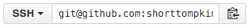

# Up and Running

## Setting up your development environment

Let's make sure you have everything you need in order to actively develop the project as well as run the finished codebase.

This chapter will ensure that your development environment is properly configured with the following dependencies:

 * Node.js and npm
 * MongoDB
 * Gulp or Webpack
 * Node.js and npm

## Node.js and npm

The first, and most important dependency that you will need to install on your system is Node.js.  Node will include npm by default, which is the "node package manager" - one of the most important and powerful tools in your arsenal.

First head over to **nodejs.org** and download the appropriate installation file for your OS - for me I'm using Mac OSX El Capitan so I will download the OSX 64bit installation file.  Which version of Node you download is up to you.  Personally I try to always run the latest `stable` version.  At the time of writing, that was `5.3.0`.

The LTS, or Long Term Support, version will be a bit lower, but can be considered much more stable and rock solid.  At the time of writing the LTS was `4.2.3`.
Once Node has been installed, head over to a terminal of choice and let's make sure you can access Node as a CLI (command line interface).  For Mac users I strongly recommend the app iTerm2, for Windows users ConEmu.  For the purposes of my writing style, whenever you see a code snippet with a `$`, that denotes that I'm demonstrating a command line execution like so:

```
$ node --version
v5.3.0
```

Assuming that your prompt looks something like above, then success!  You now have Node.js installed on your machine!  Double check to make sure npm is setup as well:

```
$ npm --version
v3.3.12
```

## npm Introduction

npm is Node's package manager.  If you're familiar with package managers in other languages it pretty much works the same way.  You use npm to define and install (download) other open source libraries and tools that you want to use in your project.  In a nutshell, don't reinvent the wheel every time you build a website!  In addition to project specific packages, you can also use npm to globally install tools which are then available in your entire development environment.  Think of these as just installing command line utilities and/or apps.

## MongoDB

With Node and npm installation confirmed and out of the way, let's move on to MongoDB.  While it's not absolutely necessary to install and run MongoDB locally for the purposes of this project, it certainly makes things easier.  The reason it's optional, however, is because you could easily use a free sandbox service like MongoLab and run your MongoDB instance in a SAAS (software as a service) provider.  However I'm going to assume that you want to install and run MongoDB locally.  If you decide not to, I will cover how to use MongoLab in a future chapter when we cover the MongoDB stuff specifically.

Head on over to **mongodb.org** and click the Download icon in the upper right corner.  Once again make sure you download the appropriate version for your OS, in my case I'm going to download the Mac OSX 64bit version.  

One thing to note is that you can very easily install MongoDB for Mac using the 3rd party package manager `homebrew`.  If you have homebrew installed (which I highly recommend you do if not) then simply issue the following installation command:

```
$ brew install mongodb
```

Once installed, open up your terminal program again and lets check to make sure everything is working:

```
$ mongo --version
MongoDB shell version: 3.2.0
```

Now that you have MongoDB installed, its important that the next step you take is to properly create and configure the default data directory.  Typically this will be `/data/db` but you steps to ensure proper permissions will vary per OS.  The Quick Start guide available on the MongoDB website (after you completed the download) offers very easy to follow instructions on how to perform these steps.  For the sake of brevity I won't include those here.

## Webpack
Now that you have Node and MongoDB installed and properly configured, you're well on your way!  The final step is to use npm to install some global packages that you will need in order to "build" and run the project:

```
$ npm install -g webpack
```

Note that the `-g` flag is how you denote that the install will be global.  Without `-g` the package will be installed in the current working directory (wherever you executed the command from) into a `node_modules` folder.  With gulp installed globally, simple execute the following to confirm its working properly:

```
$ webpack --version
webpack 1.12.9
```

Great!  Now with the Webpack CLI installed globally, we're ready to start working on the actual project!

## Git
The last thing that's going to be important to have installed on your machine is Git - the popular source control and versioning tool.  I'm certain you've heard of GitHub!  Without git installed locally, you won't be able to use GitHub - and basically you won't be able to download a copy of the project codebase.

There are a number of ways to install Git.  The best source on how to get started installing is by using this great quick start guide:
> **https://git-scm.com/book/en/v1/Getting-Started-Installing-Git**

### Clone the Project Repo
The first thing you want to do to get started with the project is actually download a copy of the full code base.  To do this, head over to the GitHub repo (repository) for the project:

> **http://github.com/shorttompkins/mrw.lol**

By the way, if you don't already have a **GitHub.com** user account you don't need one to do this, but I strongly urge you to create an account right now!

On the GitHub homepage for the project, you should see the following somewhere:


If you're familiar with SSH and have already setup an SSH key with your GitHub account, go ahead and click the little clipboard icon.  If not (or you have no idea what I'm talking about) change the SSH dropdown to HTTPS and then click the clipboard icon.

With the URL for the repo now in your clipboard, let's clone the project.  Open a terminal window and at the command prompt, first change directories to where ever you want the project to be downloaded to.  For me I typically just have a `git/` folder within my home directory:

```
$ mkdir ~/git
$ cd ~/git
```

From there, execute a`git clone <paste_url_here>` command which basically downloads a full copy of the repository:

```
$ git clone git@github.com:shorttompkins/mrw.lol.git
Cloning into 'mrw.lol'...
remote: Counting objects: 1390, done.
remote: Compressing objects: 100% (71/71), done.
remote: Total 1390 (delta 30), reused 7 (delta 7), pack-reused 1311
Receiving objects: 100% (1390/1390), 1.07 MiB | 0 bytes/s, done.
Resolving deltas: 100% (764/764), done.
Checking connectivity... done.
```

Hopefully your output looks pretty similar to what I have above.  If so, success!  You've just downloaded and cloned the project to your local development workstation.  You're ready to go!

## Running MRW.lol Locally
OK, the moment you've been waiting for.  Lets run the app locally!  With the project cloned, head into its directory:

```
$ cd ~/git/mrw.lol
```

The first step whenever you clone pretty much any web based project is to perform an `npm install`.  What this does is instruct npm to read the project's `package.json` file and download all of the required dependencies in order for the project to work.  Go ahead and do that now:

```
$ npm install
```

Now would be a great time to take a bathroom break, grab a drink, stretch etc.  This might take a few minutes.  

With the npm installation complete, you can now use Gulp to build the frontend portion of the project before running the web server:

```
$ gulp build
[20:08:38] Using gulpfile ~/git/test/mrw.lol/gulpfile.js
[20:08:38] Starting 'clean'...
[20:08:38] Starting 'copy'...
[20:08:38] Starting 'sass'...
[20:08:38] Finished 'sass' after 3.61 ms
[20:08:38] Starting 'transform'...
[20:08:38] Finished 'transform' after 23 ms
[20:08:38] Finished 'clean' after 51 ms
[20:08:38] Finished 'copy' after 50 ms
[20:08:38] Starting 'build'...
[20:08:38] Finished 'build' after 3.64 μs
```

With that out of the way, it's now time to boot up and run the web server portion.  Before we can do that, however, we need to ensure that the server can connect to a MongoDB server.  In a separate terminal window instance, boot up your local MongoDB server by simply executing the following command:

```
$ mongod
2015-12-20T20:11:39.156-0500 I CONTROL  [initandlisten] MongoDB starting : pid=98635 port=27017
2015-12-20T20:11:39.157-0500 I CONTROL  [initandlisten] db version v3.2.0
2015-12-20T20:11:39.157-0500 I CONTROL  [initandlisten] git version: 45d947729a0315accb6d4f15a6b
2015-12-20T20:11:39.157-0500 I CONTROL  [initandlisten] allocator: system
2015-12-20T20:11:39.157-0500 I CONTROL  [initandlisten] modules: none
2015-12-20T20:11:39.157-0500 I CONTROL  [initandlisten] build environment:
2015-12-20T20:11:39.157-0500 I CONTROL  [initandlisten]     distarch: x86_64
2015-12-20T20:11:39.157-0500 I CONTROL  [initandlisten]     target_arch: x86_64
2015-12-20T20:11:39.157-0500 I CONTROL  [initandlisten] options: {}
2015-12-20T20:11:39.158-0500 I STORAGE  [initandlisten] wiredtiger_open config:
2015-12-20T20:11:42.261-0500 I NETWORK  [initandlisten] waiting for connections on port 27017
```

The most important part is that last line "waiting for connections on port 27017".  That means the server is up and running and ready to go!

In the original terminal window you used to perform the gulp build task, we're going to now boot up the web server itself:

```
$ npm start
> MRW.lol@0.0.1 start /Users/jasonkrol/git/mrw.lol
> NODE_ENV=dev node --use_strict server/server.js

MongoDB connected.
Server listening at http://localhost:3500
```

Hopefully you successfully saw the "MongoDB connected" notice as well as "Server listening"!  

With that, point your browser to **http://localhost:3500** and you should see the website load up on screen.  It's not much to see but the fact that it's up at all is a huge success.  You're now well on your way to having everything you need to start developing web applications powered by Node.js, MongoDB, and a React.js frontend!

## Initialize Your Own Project

Now that you're all setup and properly configured, the last step is to create a local workspace for your own version of the project.  Create a directory and name it whatever you want to call your project - in my case I'm simply calling it `mrw.lol`:

```
$ mkdir ~/git/mrw.lol
$ cd ~/git/mrw.lol
```

Once there, we need to initalize the project using npm.  This will allow us to provide some basic meta data for the project but more importantly, any time we install dependencies for our project they will be saved to the projects `package.json` file:

```
$ npm init
```

Answer each of the questions when prompted and you're all set!

Next up, let's take a tour of the project codebase and make sure you have a stronger understanding of just what exactly is going on under the hood.
