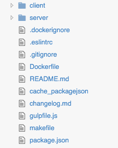
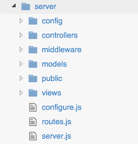
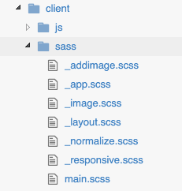

# Tour of the App and Codebase

## What does the app do?

Before we even start thinking about writing the app, lets take a quick tour of the finished product so we understand exactly what it does (and doesn’t) do.

### Homepage:
The homepage will list all of the latest images uploaded to the site newest first.  In addition, the search bar and login/register options are available at the top of every screen.  Clicking an image will go to the images details screen.

### Image Details:
When you click on an image you are presented with a fuller version to view as well as some additional details for the image. These include the image filename, unique id, and any reaction tags that have been associated with that image.  If you are currently logged in, you also see a list of your own tags associated with the image.  There is a handy `Add` button if you want to take an existing image and quickly add it to your own collection (with your own custom list of tags).

### Search Results:
Entering text into the main search box or clicking a tag on an image’s details screen will present you with a filtered version of the homepage, expect specific to the tag referenced.  This screen reuses the same components from the homepage, again only filtered by tag.

### Login/Register:
The login/register link in the header will popup a small modal window that presents the user with options to login using popular social networking sites.

### + Add Image:
Finally the Add Image screen allows logged in users to upload a new image to the site.  You have 2 options when adding an image, either attach a local file from your system or enter the URL of an image already online.  Either way the image is downloaded and saved to our server.  In addition to providing the actual image, a real-time preview window is available.  Finally a collection of unique tags should be provided for the image.  These tags are both specific to you as well as globally defined for the image. (The more users that tag an image into their collection, the more unique tags that image has globally.)

## Editor of Choice
Before we can take a look at the actual code, we need a proper editor to do so.  There are a number of popular options out there and the debate on which is the best is ever raging (and not worth getting into).  That being said here are a few really good editors I recommend:

 * [Atom](https://atom.io/)
 * [SublimeText 3](http://www.sublimetext.com/3)
 * [Visual Studio Code](https://code.visualstudio.com/)

Both Atom and Visual Studio Code are free and I personally love Atom.  I used to use Sublime exclusively and loved it.  It still has its strengths and is much faster than Atom, but I love Atom’s UX and git integration. (Sublime isn't free either.)  All 3 editors have a very robust ecosystem of plugins and configuration options.  Some of my favorite plugins (for Atom specifically) include:

 * emmet
 * linter & linter-eslint
 * language-javascript-jsx
 * language-docker
 * atom-jasmine
 * atom-beautify
 * atom-syntax-highlight-for-sass

## Miscellaneous Project Files
Before we take a look at the code of the actual project, let's take a look at the root of the project repo and the files that are listed there.  Each serves a very unique and necessary purpose so it's important that you understand what they are.

### package.json
The most important file, one we’ve mentioned already, is the `package.json` file.  This file not only contains important meta information about the project but also the master list of dependencies and versions of each.  There are 2 primary sections, `dependencies` and `devDependencies`.  The first group consists of libraries, tools, and frameworks necessary for the project to actually run.  The second, `devDependencies`, is requirements for the local development of the project.  For example, in production the devDependencies typically aren't installed because they aren't necessary for the project to actually run.  If you take a look at the list you can see all kinds of goodies including `react`, `react-router`, `express`, `mongoose`, etc.  

Traditionally in the past frontend dependencies were handled separately by Bower, which worked almost identically to npm.  However recently that mindset has changed and npm is pretty much now the defacto package manager for all things web development.

### makefile
The `makefile` is a unix/linux thing which is a way to create command line shortcuts that can be used to execute more complex command line tasks.  Specifically our `makefile` is used to create quick, easy to use commands to execute and run our Docker instances. (More on that later.)

### gulpfile.js
The `gulpfile.js` is the configuration file that Gulp will use.  This configuration file is the brains of our front-end build process.  It contains tasks defined to handle babel transpiling, bundling, browserify, sass transpiling, etc. (More on this later.)

### Dockerfile
The Dockerfile is the Docker configuration file that contains the specifics for our main Docker image.  Think of the Dockerfile as a definition and script used to boot up a virtual machine instance for our primary node server.  When Docker runs and uses our Dockerfile, it is building a brand new virtual machine (kind of, Docker actually calls these containers and instances).  That machine will have the precise settings provided in the Dockerfile and will execute the precise steps we define when it boots.

### changelog.md
The changelog file used in the repo and by me to keep track of all of the changes and features during the life of the project.

### .eslintrc
The .eslintrc file is a configuration file that specifies our ESLint rules for the project.  JavaScript syntax rules can be a heated and religious debate with some people, so it's nice that we can provide our own custom set of rules that are project specific.  This is also nice because it ensures that the code provided by every contributor looks consistent and follows our own set of standards.  That being said, the standards that I personally use in my projects follows that of a common list of best practices so there's nothing unusual or strange here.

### .ignore*
The .ignore files are specifically files that you use to list a series of files and/or paths that our tools should ignore.  In the case of the `.gitignore` file, Git will not version control or monitor changes made to the files specifically mentioned.  A good example is the `node_modules` folder.  Because we manage a list of our dependencies via our package.json file, we don’t need to actually commit and check in the `node_modules` folder.  .ignore files generally are provided to ignore temporary log files and any other files that you just don’t want showing up in the public GitHub repo. (I.e. junk files basically.)

## Server Files - Backend Node.js and MongoDB
With the project specific configuration and root files out of the way, let's take a look at how the server structure is organized and some important concepts to be aware.  Don’t worry as we’re not going to dig too deep as that will come later with each chapter that addresses certain areas (like building a basic ExpressJS server, configuration and middleware, etc).

### server.js
This is arguably one of the most important files in the server folder, even though it's one of of the smallest.  The `server.js` file kicks off your web server and starts all the magic.  Its main responsibility is to connect to the MongoDB server using Mongoose, configure the web server itself and then start the actual web server by triggering Express’s `app.listen()` method.
routes.js

Our routes file is how we define every unique "route" or path available on our site and how each path should be handled.  Typically you could think of this as:

> "if a user tries to visit mysite.com/path/to/somewhere then make sure they receive the somewhere.html file".

More importantly, we also use our routes to define API endpoints that will be accessed by our frontend application.

### configure.js
We need to configure our web server - that is provide a whole set of rules and instructions on precisely how the server should behave and react to certain conditions.  These rules include how to deal with cookies, security issues (like form sanitization), how to serve static files (like css, js, images, etc), and anything else.  When our `server.js` file kicks off the server, one of the most crucial things it does is execute the main configuration and initialization found within this `configure.js` file.

### /config
Here is where we store environment specific json files for various settings for our app.  Mainly this includes the differences between developing locally and when the app is running in production.  For example there is a setting for `mongodb` which contains both the db and host for the server. Locally this will likely be something like "localhost" but in production you might want to instead point to a different server altogether (MongoLab or just an IP address of a different machine).

Additionally the config folder contains the `auth.js` file which contains all of the social network API keys for your account.

### /controllers
The controllers are the brains of web server, with regard to every path available in our routes. I tend to think of a controller as having a 1:1 relationship with paths defined in my `routes.js` file.  When I have a route for say `/aboutus` then I want that route to use the `controllers/aboutus.js` file.  That file will then worry exclusively about whatever logic it needs to be concerned with only with regard to the about us page.

One thing to note is that the API endpoints that our React app will communicate with will reside within the controllers folder as well. Since the API endpoints are defined in our routes file, I felt it only made sense that the controller logic for each endpoint reside with controllers as well.  However they are in a subfolder labeled `api`.

### /middleware
Express is the framework we’re using for the "MVC" approach to our web server.  Express by itself does a few simple things very well.  These include routing and request/response handling.  However it doesn’t do much else.  This is where middleware comes in.  We can download and reference a number of different popular modules to use as middleware that will make Express more powerful overall.  These middleware handle things like cookies, forms, json, static files, etc.  We will cover middle in more depth in the chapter devoted to Express.

### /models
One of the benefits of MongoDB is that it features a "schema-less" design.  What that means is that you don't have to define your data models or anything like that, you can just change a record however you see fit.  However, I’m still a fan of a code-first approach to my data models.  As such I like to properly define the models and this is one of the reasons I love Mongoose so much.  Mongoose acts like an ORM for our data collections, providing us with easy to use JavaScript objects that resemble our MongoDB records.  The `/models` folder is where we will store our data model definitions (specifically for Mongoose).

### /public
The public file is just where any and all of our static files will live that are served by the web server.  Mostly css, random js, images etc will live here.  One important thing to note, however, is that our build process has been setup so that the final bundled version of our frontend app will be stored within the public folder.  Additionally any and all images uploaded by users will be stored in the `/public/upload` directory.

### /views
Finally we have our `views` folder which contains all of the HTML templates that the web server will serve.  Most importantly we have the homepage which acts as the root of our single page React app.  But we do have some basic static standalone pages too so those are stored here as well.

## Client Files - Frontend React.js, JavaScript and SASS

The project itself is divided into 2 key areas - server and client.  The server we’ve already covered.  Next up is the client files.  The client directory stores all of the front-end specific files.  These files are never directly served by our web server, which is why they are in their own root level directory.  Our build process will actually work through all of these files and ultimately spit out a new bundled single file that gets copied to the `server/public` path to be served to the browser.

### /sass
Like all good front-end projects, we’re using a CSS transpiler for our styles. I’ve decided to use SASS as it's pretty much the most popular.  There are other options like LESS etc, but like I said SASS works really well and is very popular.  SASS basically super powers your CSS - allowing you to do really great things like using variables, mixins, partials, and nesting!  It transpiles to pure CSS in the end, which then gets sent up with the app’s single JavaScript file to the browser (and its a match made in heaven!).

The `/js` folder is where the actual JavaScript for our React app lives.  We could also include separate folders for fonts, images, etc.

### /main.js
Not unlike the `server.js` within the root of our `/server` folder, `main.js` acts as the main kickoff location for our front-end app.  Since we’re using `react-router` our main.js file basically just instructs React to use our router to render the page to the div with an id of ‘app’.

### /routes.js
Routes.js on the client site works very similarly to the counterpart on the server side. Although the "screens" on the frontend app don't match directly with the routes defined for our server.  With the React routes, we’re literally defining every screen that's visible via a unique url in our app.  Each path then corresponds directly 1:1 with a React Component.  If you’re at all familiar with Angular and its routes, this works almost exactly the same way.  Except instead of controllers, we’re tying routes to Components.

### /components
This is where all of our React.js components will live.  I like to give each core component group its own folder, and then store every component, no matter how small, within its own uniquely named file.  Depending on the complexity of your app, this collection could (and should) grow quite large!

One important thing to note is the `App.js` file within the root of `/components`. This single component will act as a "container" component, basically housing the app itself.  This component is responsible for rendering the layout of the app, the header, and finally whichever screen we’re looking at via a unique route, the React Router will pass into the App component via its children. (In this case, a single core component per screen.)

### /utils
The `utils` directory is basically a catch-all bucket for us to house a few loose odds and ends for our project.  The contents of this directory will be covered in more depth in later chapters.

### /stores, dispatchers, constants, actions
Since we are going to be using Flux for our application, these are some standard things that we will build that pertain specifically to the Flux design pattern.  Much more about these in the Flux chapter later on.

And that basically concludes our tour of the app and project codebase.  At this point you should feel pretty comfortable poking around and know where everything is and generally what each file's role is.  Feel free to experiment and make some changes!
