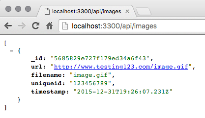

# MongoDB and Mongoose Models

I'm not going to lie, I'm a big fan of MongoDB.  There's something about working with pure raw JSON when querying a database that really struck a cord with me.  When I originally started creating this project MongoDB was an obvious choice for me.  As development moved along, I started to question if it really made sense.  I tried switching over to PostgreSQL and while many would argue that it makes more sense in a scenario like this - for me it was literally six of one, half dozen of the other.

I'm not advocating that MongoDB is the end-all be-all database solution, and it's important that you evaluate the pros and cons of each when designing your architecture.

That being said, I love MongoDB.

## Additional Dependencies

Before we can do anything with MongoDB in our Express server, we need to install a few npm dependencies first:

```bash
$ npm install --save mongoose connect-mongo
```

## Connecting to MongoDB

With our Node Express server up and running, we're ready to move on to the next step of connecting to our MongoDB server and pulling down some real data for our app to use.  

> *Note: This chapter assumes you've completed the previous chapter on writing your Express web server.*

The very first thing we need to do is ensure that our Express web server can connect to and communicate with the MongoDB server.  Edit the `server/server.js` file and replace the contents with the following code:

```javascript
// server/server.js:
let express = require('express'),
    app = express(),
    configure = require('./configure'),
    mongoose = require('mongoose')

app = configure(app)

mongoose.connect('mongodb://localhost:27017/mrwlol')
mongoose.connection.on('open', () => {
  console.log('MongoDB connected.')

  app.listen('3300', () => {
    console.log(`Server listening at http://localhost:3300`)
  })
})
```

Two important additions to this file.  First we required `mongoose` at the top.  Second execited `mongoose.connect` with the connection string to our locally running MongoDB server.  The connection string path contains the database name that we want to work with.  Don't worry - the beauty of MongoDB is that if the database doesn't exist Mongo will go ahead and create it automatically (same with collections).  Once the connection has been established, then we fire our Express server `app` to start listening and serving up content.

Fire up your server one more time and let's make sure MongoDB is connecting:

> *Note: Make sure you have MongoDB running locally in another terminal window or as a process.  The easiest way is to simply open another terminal and execute `mongod` which should result in a bunch of output followed by `waiting for connections on port 27017`*

```bash
npm start

> node --use_strict server/server.js

MongoDB connected.
Server listening at http://localhost:3300
```

Success!  Now our Express server is connected to our MongoDB server.  Before we go any futher, now is a good time to make a quick change to our configured middleware - specifically the `express-session` middleware.  By default `express-session` uses memory to store sessions, which not only is a bad idea but is explicitly stated so in the `express-session` docs.  We want our sessions to be stored in a MongoDB collection instead.  Lets make a quick change to our configured middleware to support this.  Edit `server/configure.js` and insert the following change to the `middleware.session` section:

```javascript
// server/configure.js:
app.use(middleware.session({
  secret: 'SECRETHERE',
  resave: false,
  saveUninitialized: false,
  // the following line is new:
  store: new MongoStore({ mongooseConnection: mongoose.connection })
}))
```

Before that will work, we need to `require` a few modules at the top of the file:

```javascript
// server/configure.js:
let path = require('path'),
    express = require('express'),
    routes = require('./routes'),
    middleware = require('./middleware'),
    // the following lines are new:
    mongoose = require('mongoose'),
    MongoStore = require('connect-mongo')(middleware.session)
```

Now that our connection is working we're ready to start working with some real data!

## Create Mongoose Models

One thing I love about MongoDB is the Mongoose module.  The Mongoose homepage explains it best:

> Writing MongoDB validation, casting and business logic boilerplate is a drag... Mongoose provides a straight-forward, schema-based solution to model your application data. It includes built-in type casting, validation, query building, business logic hooks and more, out of the box.

Outstanding! One of the key strengths of MongoDB is its "schema-less" design approach.  However as a developer, when I'm writing code I like to have a mental modal of what the schema actually is.  Call this OOP, RDBS from a past life, whatever.  What all this means is that we're going to define our MongoDB collections using Mongoose models and schemas.  Lets start by creating the core model for our entire application - the image.  Create and edit the `server/models/image.js` file and insert the following code:

```javascript
let mongoose = require('mongoose'),
    Schema = mongoose.Schema

let ImageSchema = new Schema({
  url:        String,
  filename:   String,
  uniqueid:   String,
  timestamp:  { type: Date, default: Date.now() }
})

module.exports = mongoose.model('Image', ImageSchema)
```

Pretty basic - using Mongoose's Schema object, we define a new `ImageSchema` which has a few properties that we want to define ahead of time.  What we actually export is a Mongoose `model` thats defined by `ImageSchema`.  Its this model that we will use throughout the server to interact with the MongoDB server.

Mongoose allows us to do some pretty fancy stuff too like adding virtual properties to our models, static methods, etc.  More on that in a little bit.

Since we're going to eventually have a number of different Mongoose models, lets create an index module now.  Create and edit the file `server/models/index.js` and insert the following code:

```javascript
module.exports = {
  Image: require('./image')
}
```

Now that our Image model is defined, let's use it!  

## JSON API Endpoint

We're going to create our first pure JSON "API" endpoint on our server that our front-end app will eventually consume.  For now we're just going to use regular browser to make GETs to it.

First create the following `index.js` file within `server/controllers/api/`:

```javascript
// server/controllers/api/index.js
module.exports = {
  images: require('./images')
}
```

Next let's create the `images` API controller referenced above. Create and edit the `server/controllers/api/images.js` file and insert the following code:

```javascript
// server/controllers/api/images.js
let Models = require('../../models')

module.exports = {
  list(req, res) {
    Models.Image.find({}, (err, images) => {
      res.json(images)
    })
  }
}
```

Let's break down the `list` function a bit to make sure we understand whats happening.  First we reference our `Models.Image` Mongoose model and use its builtin `find` method.  This `find` method works exactly the same way as a regular MongoDB query does (i.e. you pass a JSON definition of how strict you want to match).  Passing in an empty JSON object will simply return every record.  The callback that gets called after the query accepts 2 parameters, an error object and an array of records found.

Taking the returned array, we simply use Express's built in `json` response method to return a JSON respose to the browser that contains the array of images returned from MongoDB.

With this API controller method defined, we now need to define a way to actually hit this from the browser.  For that we will need to add a route.  Edit the `server/routes.js` file now and include the following line after the first `router.get` line:

```javascript
// server/routes.js
router.get('/api/images', api.images.list)
```

> _Note: Don't forget to require the images api module at the top of routes.js with `let api = require('./controllers/api')`_

With those changes saved, fire up your server again (`npm start`) and open `http://localhost:3300/api/images` in a browser.  If successful, you should just get a simple `[ ]` rendered as basically an empty JSON array.  Thats because our MongoDB collection is empty.  But this proves that everything is connected correctly and our server is still healthy!

Let's do a quick experiment by inserting a sample record into MongoDB.  In another terminal window, execute `mongo` which is the command line interface to MongoDB:

```bash
$ mongo
MongoDB shell version: 3.2.0
connecting to: test
>
```

The first thing mongo does is connect us to the `test` database (which isn't very helpful). Lets switch to our `mrwlol` database by executing:

```bash
> use mrwlol
switched to db mrwlol
```

Now if we execute the same `find` query on our Images collection we should get an empty response as well:

```bash
> db.images.find({})
>
```

Let's insert a new record:

```bash
> db.images.insert({url: 'http://www.testing123.com/image.gif', filename: 'image.gif', uniqueid: '123456789' })
WriteResult({ "nInserted" : 1 })
>
```

Now if you execute the same find command from earlier:

```bash
> db.images.find({}).pretty()
{
	"_id" : ObjectId("5685829e727f179ed34a6f43"),
	"url" : "http://www.testing123.com/image.gif",
	"filename" : "image.gif",
	"uniqueid" : "123456789"
}
```

Better yet, go back to your browser (if your server is still up and running) and refresh the page.  Now you should see the JSON response for the Image we just inserted!



## Conclusion

In this chapter we accomplished a lot (with very little code)!  We established a connection to our MongoDB server, integrated Mongoose into the server so that we can create our own models.  Created our first Image model as well as our first API endpoint to list the collection of images in our database as a JSON array.

With all of this groundwork out of the way, we can now start to focus on the front-end React application.  In the next chapter you will create your first React components.

Furthermore this is me editing blah blah!
