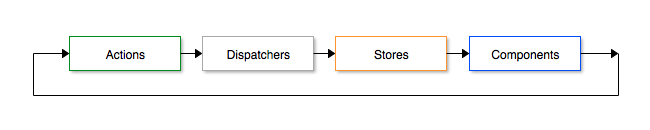
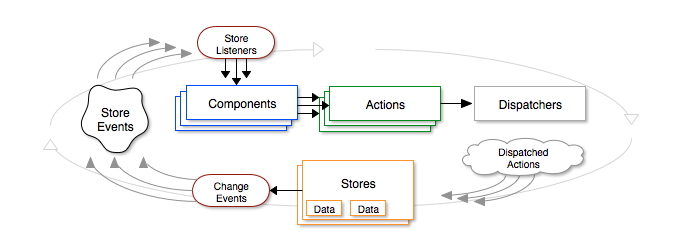

# Using Flux with React

Up until recently, the dominant design pattern that's been used when architecting single-page-applications with JavaScript has been the MVC or MV* pattern.  This is the traditional model view viewModel controller approach.  With the introduction of React.js, Facebook also ushered in a whole new paradigm and approach to application data flow.

## Introducing Flux

Flux is the name of the architecture pattern that is most popular with React.js development. Flux isn't exclusive to React.js nor is it really a framework at all - it's more of a concept (design pattern basically).  With Flux the idea is that you have a `unidirectional` flow of data.  Data only flows in one direction.  Typically this works by having a single source of truth for your data - called a **Store**.  Your **Components** all get their data from your Store(s) as well as listen to the Store(s) for `change` events to be emitted.  If a change event is emitted, the Component will get the latest version of the data from the Store and rerender itself.

On the flip side, if a Component ever wants to change data within the Store, it has to trigger an **Action**.  Actions handle the change request and send a message using a **Dispatcher** that the Stores listen to.  If a Component triggers an Action, and that Action sends a message via a Dispatcher that the Store is listening for, the Store will take the information from the Dispatcher and make the appropriate changes.  Then the loop will complete when the Store emits a change event, which Components listening for will retrieve the updated Stores data and rerender.

Here's a slightly more advanced diagram that explains the flow a little more:

The beauty (and curse) of Flux is that since its not a framework but an idea, we can implement it ourselves with very little code. (The downside is that this causes there to be many different implementations out there.)  We only need a small dependency via Facebook's Flux module which basically contains a Dispatcher.  In this chapter we will wire up our own Flux implementation and then take a look at some of the popular 3rd-party alternatives out there that are worth considering.

### Example Scenario

Let's take a real-world example and examine the flow as it falls under the Flux pattern.  You have a Component that displays a list of widgets.  Your list of widgets is stored in a database on your server so you need to issue an async AJAX call to the API to retrieve this list.  You want to store the list of widgets within your Flux Store so that the list is available to the entire application (not just this simple list view Component).  The widgets list component can also delete widgets from the collection.

When the list component initially renders, it will get the collection of widgets from the Store.  However when the component first loads the collection will probably be empty because the Store hasn't even received it yet from the API.  The component will render an empty collection and then wait and listen for events from the Store to see if the Store's data has changed. 

Meanwhile, since the app was just loaded, the App component will issue an Action to indicate the widgets should be retrieved from the backend API.  The action itself will make the AJAX call and when the call is successful, will dispatch an actionType of `getWidgetsSuccess` which also contains a payload that is the response from the API (the JSON collection of widgets basically).  When the Store receives a message from the Dispatcher it will check to see if it's a message it even cares about - in this case the message is `getWidgetsSuccess` and our Store very much cares about this.  The Store takes the payload that came with the dispatched message and updates its internal data model to reflect the new data (in this case the collection of widgets that was returned from the API).  With the Store's internal data model updated, it emits a `change` event.  Any components listening for that change event from that Store will respond accordingly.  In this case, our widgets list view component has a listener and when the listener receives a message, it updates its own internal state with the new widgets collection and `render()s`.  Now that the component actually has data, the render actually outputs HTML to the screen with the list of widgets.

When a user interacts in a way with the list to indicate a widget should be removed, the component's handler function will issue an action `deleteWidget`.  That action will dispatch a message indicating a `deleteWidget` action was performed along with a payload that contains simply the `widgetId` for the widget that is to be deleted.  Once again our Store receives a dispatched message, checks that its one it cares about - in this case the Store also very much cares when a `deleteWidget` action is dispatched.  The Store takes the payload, performs a lookup against its own internet data model (collection of widgets) and removes the matching item based on the payloads `widgetId` and once again emits a `change` event.  The cycle repeats as the Component receives the change event, gets the refreshed version of the widgets collection from the Store, and renders the new list again.

# Homegrown Flux Implementation

We're going to create our very own homegrown Flux implementation from scratch.  This is primarily so you can see just how easy it is but also so we can keep the Flux implementation barebones and avoid overly complicating the project.

## Dispatcher

OK so I lied.  Even though I just said we're going to write our own Flux implementation, we're actually going to rely on Facebook's Flux implementation and use *their* Dispatcher because why reinvent the wheel.  The Dispatcher is really quite basic and elegant in its simplicity.

```
$ npm install --save flux
```

Next create and edit the file `client/js/dispatchers/Dispatcher.js` and include the following code snippet:

```javascript
import { Dispatcher } from 'flux'
export default new Dispatcher()
```

Thats it!  Facebook did a great job creating a super basic Dispatcher that really is just a collection of callbacks.  Feel free to check out `node_modules/flux/lib/Dispatcher.js` - it's a small file and fairly easy to understand.

## Actions

Our Actions are literally just plain ol' JavaScript objects that contain functions that we can use throughout our application.  Think of an action literally the way you think of every day actions - go get something, take a nap, turn on tv, drive to work, etc.  Likewise you should consider your actions as completely isolated functions that perform a very specific task.  

Since we're going to be making AJAX calls via our actions, and React by itself has no means to do this, we need to include another dependency into the project.  SuperAgent is a 3rd-party module that specifically handles AJAX calls and does it very well.  Let's include that now:

```
$ npm install --save superagent
```

Here we will create a simple Action module.  Create and edit the file `client/js/actions/ImageActions.js` and insert the following code:

```javascript
import AppDispatcher from '../dispatchers/Dispatcher'
import request from 'superagent'

export default {
  loadImages() {
    AppDispatcher.dispatch({
      actionType: 'LOAD_IMAGES'
    })
    
    request
      .get('/api/images')
      .end((err, res) => {
        if (err) {
          AppDispatcher.dispatch({
            actionType: 'LOAD_IMAGES_FAIL',
            error: err
          })
        } else {
          AppDispatcher.dispatch({
            actionType: 'LOAD_IMAGES_SUCCESS',
            images: res.body
          })
        }
      })
  }
}
```  

This `Actions` module has a single function `loadImages` that does 4 things:

  * First it immediately dispatches a `LOAD_IMAGES` action type - this is specifically so we can indicate that an AJAX call is about to start (i.e. with a loading spinner or something in our UI).  
  * Next it makes an AJAX GET request to our backend API `/api/images` endpoint
    * If the API GET returned an error, the Action will dispatch another action type of `LOAD_IMAGES_FAIL` with the error as its payload.
    * Otherwise if the API GET was successful, the Action will dispatch `LOAD_IMAGES_SUCCESS` along with the actual payload that was returned from the server (in this case the `images` array).

At this point, our Action is complete! Again it's important to note and understand that our Actions are completely isolated procedures.  They don't rely on other functions or Actions, they don't care about components, they don't touch the DOM or anything like that.  The just perform simple tasks and dispatch `actionTypes`. 

### ActionTypes
One thing I want to point out is that so far in our Actions, we're using simple strings to denote `actionTypes`.  This is fine, but eventually will become a problem because we're going to refer to that same string in other places throughout our app (i.e. Stores, etc).  It would be much better if we isolated our `actionTypes` into a dictionary that we can then refer to everywhere.  Let's do that now.  Create and edit the file `client/js/constants/ActionTypes.js` and include the following code:
 
```javascript
export default {
  LOAD_IMAGES: 'LOAD_IMAGES',
  LOAD_IMAGES_SUCCESS: 'LOAD_IMAGES_SUCCESS',
  LOAD_IMAGES_FAILURE: 'LOAD_IMAGES_FAILURE'
}
```

Now with our `actionTypes` dictionary module defined, we can use that within our `Actions` module.  Edit `client/js/actions/ImageActions.js` and replace it with the following slightly modified version:

```javascript
import ActionTypes from '../constants/ActionTypes'  // <- new!
import AppDispatcher from '../dispatchers/Dispatcher'
import request from 'superagent'

export default {
  loadImages() {
    AppDispatcher.dispatch({
      actionType: ActionTypes.LOAD_IMAGES   // <- new!
    })
    
    request
      .get('/api/images')
      .end((err, res) => {
        if (err) {
          AppDispatcher.dispatch({
            actionType: ActionTypes.LOAD_IMAGES_FAIL,  // <- new!
            error: err
          })
        } else {
          AppDispatcher.dispatch({
            actionType: ActionTypes.LOAD_IMAGES_SUCCESS,  // <- new!
            images: res.body
          })
        }
      })
  }
}
```

You'll see why this change was important once we start creating our Stores next.

## Stores

Now that we have an Action that can successfully make an AJAX GET call to our API, its time to handle the data thats returned.  That data we're going to save in our Store.  Create and edit the `client/js/stores/ImagesListStore.js` and include the following snippet of code:

```javascript
import AppDispatcher from '../dispatchers/Dispatcher'
import ActionTypes from '../constants/ActionTypes'
import { EventEmitter } from 'events'
import { assign } from 'lodash'
```

First we make sure to `import` our Dispatcher and ActionTypes modules as we will need those in our Store.  We also included Node's `EventEmitter` built in module because we are going to want our Store to be able to listen for and emit events based on the actionTypes that come in via our Dispatcher.  Finally we included the `assign` function from the `lodash` library since we're going to be extending our store as an EventEmitter.

Next include a simple array that we will use to store the data for our Images collection:

```javascript
let _images = []
```

Our store itself will be a JavaScript object, but we're going to want it to adopt all of the functionality of the EventEmitter so this is where we will rely on lodash's assign function:

```javascript
let ImagesStore = assign({}, EventEmitter.prototype, {

})
```

Since we're assigning the EventEmitter prototype to our `ImagesStore` object, we gain the functionality from EventEmitter.  Lets define a few functions to take advantage of those now.  Inside the `ImagesStore` object include the following code:

```javascript
  emitChange: function() {
    this.emit('change')
  },

  addChangeListener: function(callback) {
    this.on('change', callback)
  },

  removeChangeListener: function(callback) {
    this.removeListener('change', callback)
  },
```

The `emitChange` function simply emits a `change` notification to any listeners.

The `addChangeListener` and `removeChangeListener` functions accept a callback function as a single parameter and, using EventEmitter, manage those callbacks within an internal callback collection.

Next we need a way for any Components interacting with our Store to get access to that internal `_images` array.  For this we will include a simple function called `getImages` that returns that array:

```javascript
  getImages: function() {
    return _images
  },
```

Last but not least we need to link our Store with our Dispatcher.  The primary method of doing this is by using the dispatcher's `register` function.  The `register` function within the dispatcher simple manages a collection of callbacks that have been assigned (by any number of Stores).  This way, whenever a dispatcher dispatches a message, it will broadcast to every store that has registered itself with it.  This is why we can have a single dispatcher within our application but many stores.  Include the following code snippet:

```javascript
  dispatcherIndex: AppDispatcher.register((payload) => {
    let { actionType } = payload

    switch(actionType) {
      case ActionTypes.LOAD_IMAGES_SUCCESS:
        _images = action.images
        ImagesStore.emitChange()
        break
    }   

    return true
  })
```

In the above code, we first hold the `index` that is returned from the dispatcher's `register` call.  Within our callback we perform a `switch` against the `actionType`.  In the event that the dispatcher dispatches an actionType of `LOAD_IMAGES_SUCCESS` we want to know about that - we take the payload that was sent with the dispatches action and store the `images` data in our `_images` array.  Finally we `emitChange` since we changed our Store and we're finished!

Finally, export our `ImagesStore` module so we can use it:

```javascript
export default ImagesStore
```

Our `ImagesStore` is now ready to be used on by our Components.

> #### BaseStore Wrapper
> You might have noticed that there is a bit of boilerplate code in this Store example.  Namely the EventEmitter stuff; `emitChange`, `addEventListener`, and `removeEventListener`.  This can start to get annoying as you have more and more stores within your application.  In the source code for the final project I created a `utils/    baseStore` wrapper that allows you to focus on just the important parts of your store (i.e. those that are actually specific to what you want to accomplish) and let the `baseStore` wrapper handle the boilerplate stuff.

## Components

So far we've created our app's Actions, defined our actionTypes via a constants dictionary, created our app's Dispatcher, and created our first Store.  Next we're going to tie it all together by implementing changes to our `ImagesList` component to issue an action, listen to changes to our Store, and render real data from our API!

We can start first by simply `importing` the `ImagesListStore` in our `ImagesList` component and issuing a `getImages()` call from the component's `constructor()`.  Then we can simply refer to `this.state.images` in the component's `render` function to render the images collection.  Edit `client/js/components/images/ImageList.js` and include the following new code:

```javascript
import ImagesListStore from '../../stores/ImagesListStore'
```

First ensure that we `import` the Store module.  Next include a `constructor()` within the component class definition:

```javascript
constructor() {
  super()
  this.state = { images: ImagesListStore.getImages() }
}
```

Finally within the `render()` function, before the `return ()` include the following code:

```javascript
let images = this.state.images.map(image => {
  return (
    <li>{image}</li>
  )
})
```

What we're doing here is using the Array.prototype.map function to iterate through the collection of images in the component's `state` and return a new array that is a collection of JSX objects (in this case simple `<li></li>` elements).  With this new `images` array of JSX objects, you can now render that anywhere within the `return ()` section of the `render()` function:

```javascript
return (
  ...
  <ul>
    {images}
  </ul>
)
```

Since the `getImages()` function of our `ImagesListStore` is currently returning an empty array, you're probably not going to notice anything different if you build and run this latest version.  You can easily test, however, by prepopulating the `_images` array in the `ImagesListStore` with dummy placeholder values.

## Issuing an Action

As of right now, our component is retrieving data from our store, however our store is empty because it never received the actual payload of data from any actions.  Let's fix that by calling an action from our component.

First be sure to `import` the `ImageActions` module:

```javascript
import ImageActions from '../../actions/ImageActions'
```

Next we will trigger the action within the `componentWillMount()` phase of the component.  Include the following code within the component's class definition:

```javascript
componentWillMount() {
  ImageActions.loadImages()
}
```

> #### Time to Run the Server
> Since we're making our first AJAX call to our API from the front-end app, it's time to boot up the server and make sure it's running.  Likewise if you've just been opening the `index.html` file from this point you're going to want to instead use the `http://localhost:3300` url to load the app from here on out.
> 
>   To get started, edit `server/views/home.html` and replace it with the contents of `server/public/mrw/index.html`.  Be sure to change the path for the `.css` and `.js` files for the app to include `public/mrw/`.

If you run the app again, you'll probably notice that there's still no data on the screen?!  Well thats because when our component first mounts and renders, the AJAX call didn't even have a chance to finish its round trip.  Because of this asynchronous nature, we need to ensure that our component is listening to our store for any changes that occur!

> ### Check Browsers Network Log
> If you take a look at your browsers debug network log you should see the XHR request to the API and the payload it returned (in this case, an array of images).  This way you know your app is working as expected so far.

## Listening for Store changes

Our component is making a request to our store, but it's only doing it once at the very beginning of the components lifecycle.  It's also issuing the action that triggers the store to be updated with real data from the server.  What we need to do now is teach our component how to listen to the store for changes and react accordingly (i.e. re-retrieve the changed data and re-render).

Within the constructor for the `ImagesList` component, insert the following line of code that will add a change listener to the `ImagesListStore`:

```javascript
ImagesListStore.addChangeListener(this._onChange)
```

Next we need to actually define `this._onChange` so let's create that now.  Include the following function within the class definition for the `ImagesList` component:

```javascript
_onChange = () => {
  this.setState({ images: ImagesListStore.getImages() })
}
```

What the `_onChange` function does is simply reset the component's state by retrieving the images collection via `getImages()` (again).  So at this point, when our component is initialized (via its constructor) an initial `getImages()` occurs.  Only after that does our `componentWillMount()` function fire off an action that causes the store to update its collection with real data.  When the store issues a `change` event its going to iterate through its collection of `changeListeners` and fire each one sequentially.  In this case, the only callback function within that collection is the one we just defined with `_onChange`.

The last piece of housekeeping we need to take care of is to make sure to remove any `changeListeners` that we've applied for this component when the component is destroyed.  If we don't we will wind up with hundreds of orphaned event listeners and you will start to see reduced performance (or worse)!  Include the following function within the `ImagesList` class definition:

```javascript
componentWillUnmount() {
  ImagesListStore.removeChangeListener(this._onChange)
}
```

To review here is our entire `ImagesList` component found in `client/js/components/images/ImagesList.js`:

```javascript
import React, { Component, PropTypes } from 'react'
import { Link } from 'react-router'
import ImagesListStore from '../../stores/ImagesListStore'
import ImageActions from '../../actions/ImageActions'

class ImagesList extends Component {
  constructor() {
    super()
    this.state = { images: ImagesListStore.getImages() }
    ImagesListStore.addChangeListener(this._onChange)
  }
  _onChange = () => {
    this.setState({ images: ImagesListStore.getImages() })
  }
  componentWillMount() {
    ImageActions.loadImages()
  }
  componentWillUnmount() {
    ImagesListStore.removeChangeListener(this._onChange)
  }
  render() {
    let imageId = '123abc456def'
    let images = this.state.images.map(image => {
      return (
        <li>{image._id}</li>
      )
    })
    return (
      <div>
        <div className="images">
          List of Images will appear here...<br/>
          <Link to={`/image/${imageId}`}>View image details</Link>
          <br/><br/>
          <ul>
            {images}
          </ul>
        </div>
      </div>
    )
  }
}

export default ImagesList
```

> #### Higher Order Components
> As you can probably imagine, thats a lot of boilerplate to wrap in a component and keep track of just to get some simple store data and listeners.  It's quite common to have this kind of functionality exist in many of the components you write.  It's going to get quite tedious to have to worry about including code to `addChangeListeners` and `removeChangeListeners` and `onChangeThis` and `onChangeThat` all of the time.  Fortunately theres a pretty convenient way we can take care of this.
> 
> We can create a "base" component that will act as a higher order component - taking your actual component as a child and wrapping all of the functionality we want so that our component can be connected to a store.
> 
> Take a look at the `utils/connectToStores.js` file to see how this higher order component wrapper was created and how to implement in your project!

## Popular Flux Frameworks

I'd be remis if I didn't take a moment to discuss the many different Flux frameworks/libraries out there:  

### Redux

Redux is by far the most popular Flux implementation currently and for good reason.  Its author, Dan Abramov, is extremely active in the community and generally a really great guy.  Very approachable and is doing everything he can to make new users transition to React and Flux as easy as possible!

A few other frameworks worth mentioning include:

 * Alt - great documentation!
 * Fluxxor
 * Flummox
 * Reflux

## Conclusion

We covered a lot in this chapter!  It's quite understandable if you're still a bit confused.  Flux is a totally new paradigm shift in application design and sometimes it takes a few go arounds before it all starts to truly click.  Not only did we take a crash course on Flux, we also added a basic version of our own Flux implementation into the project!  

Our front-end app now issues Actions that perform asynchronous AJAX calls, stores data in a centralized Store, uses a Dispatcher to send messages to the Store, and finally has Components that listen to Stores for changes and react by re-rendering new data!  

Next up it's time to create the Image Upload component that will introduce a few new React concepts along the way.


